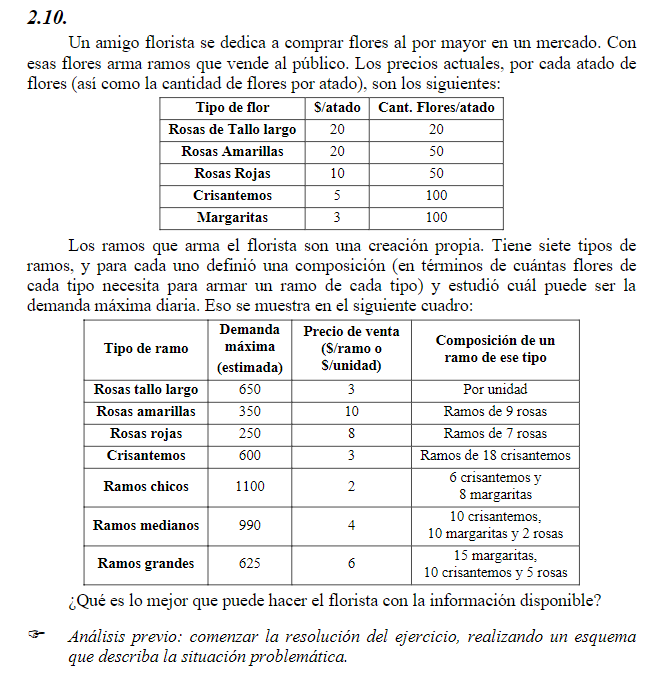

## Analisis
Es un problema de **armado**, se busca optimizar la compra de atados de flores (por mayor) y la produccion de diferentes tipos de ramos en base a la demanda diaria. La idea de maximizar ganancia.

##   Objetivo
- **Que hacer**: Determinar que atados y
- **En cuanto**: En un dia
- **Para que**: Maximizar ganancia

##   Supuestos
- No se venden ramos incompletos
- No hay inflacion
- Todo los ramos que se producen se venden
- Hay mano de obra y capital suficiente
- Todos las flores del mismo tipo son iguales e indistinguibles
- No hay fallos en la produccion
- No hay flores en mal estado , las flores no se mueren en el dia
- Se disponen de todos los atados al inicio del dia
- La creacion de los ramos es despreciable
- Los ramos de rosas de un tipo determinado estan compuestamente por rosas de ese mismo tipo.

##   Variables

##   Funcion Objetivo
$$Max(Z) = $$
$$Min(Z) = $$

##   Restricciones

##   Resolucion por software