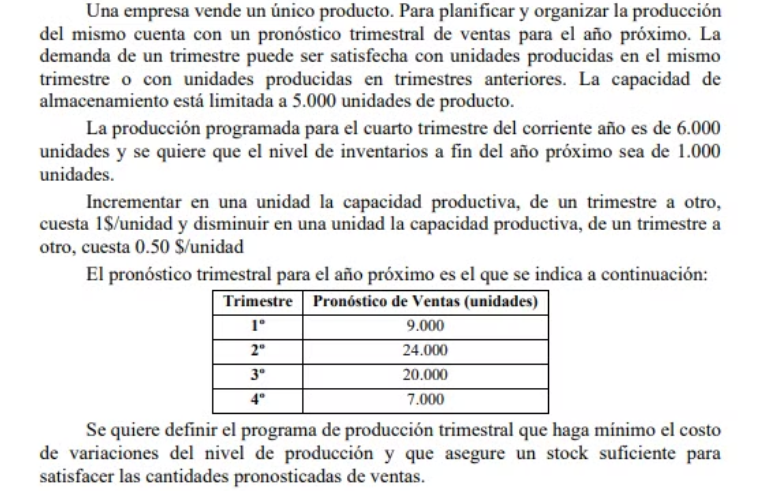

## Analisis

Problema de planificacion de produccion multiperiodo

Es la organizacion de la venta de un producto planificada por trimestres a lo largo de un año (un año tiene 4 trimestres). Cada trimestre se puede satisfacer su demanda con unidades producidas en el mismo trimestre o anteriores -> hay stock aunque es limitada hasta 5.000 unidades.

Tambien en el ultimo trimestre hay una produccion fija de 6000 productos.
y se quiere que el nivel de inventarios a fin de año proximo sea de 1000 unidades -> se stockean a final de año

Hay un costo de precio por unidad de 1$ si se quiere aumentar la capacidad productiva de un trimestre a otro. Y disminuir tambien cuesta 0.50$ por unidad -> esto es algo que tengo que tener en cuenta

Hay un pronostico de ventas

##   Objetivo
- **Que hacer**: Definir la cantidad de productos a producir, cumpliendo con un stock necesario apra las ventas
- **En cuanto**: en un año
- **Para que**: para minimizar el costo de variacion de nivel de produccion

##   Supuestos
- Todo lo que esta a la venta, se vende
- El tiempo de produccion de un producto es menospreciable
- Hay materia prima suficiente
- No hay limitaciones de tiempo en la traslacion de objetos
- Todo es instantaneo
- Se vende exactamente todo lo pronosticado en ventas por trimestre
- No hay defectos ni fallas en la produccion
- Se puede dejar un producto a medio hacer para finalizarse el proximo trimestre
- No hay restricciones de mano de obra ni financieras
- No hay inflacion ni variacion de precios
- Solo hay restricciones de stock al final del mes
- No hay aumento ni disminucion en el primer trimestre del proximo año con respecto al ultimo del trimestre de este año
- No hay perdia de stock

##   Variables
- $P_i$ = cantidad de unidades producidas en el trimestre $i$
- $V_i$ = cantidad de unidades vendidas en el trimestre $i$
- $St_i$ = Stock de unidades al final del trimestre $i$
  
>💡Como voy a tener exceso o defecto de produccion con respecto al mes anterior, tengo que hacer 2 variables  
> Para que ambas sean mayor a 0.
- $D_i$ = Defecto de diferencia de produccion entre el trimestre $i$ y el anterior
- $E_i$ = Exceso de diferencia de produccion entre el trimestre $i$ y el anterior

##   Funcion Objetivo
>💡Esta depende de los gastos que voy a tener, y solo tengo que ver si aumento o disminuyo la cantidad producida  
> Tengo un costo de 1$ por aumentarla y de 0.5$ si disminuyo  
> Aumentar significa que voy a ahcer mas productos ese trimestre  que el anterior  
> Disminuir, hacer menos productos.

$$Min(Z) = \frac{1\$}{unidad} (E_1 + E_2 + E_3 + E_4) + \frac{0.5\$}{unidad}  (D_1 + D_2 + D_3 + D_4) $$

>🤚🏼 Pero si el defecto o efecto es negativo que pasa? Se cancela?

##   Restricciones
### Produccion
  - $P_0 = 6000$
  - $P_1 >= 0$
  - $P_2 >= 0$
  - $P_3 >= 0$
  - $P_4 >= 0$

### Almacenamiento
  - $St_0 = P0 - V0$
  - $St_1 = St_0 + P1 - V1 \le 5000$
  - $St_2 = St_1 + P2 - V2 \le 5000$
  - $St_3 = St_2 + P3 - V3 \le 5000$
  - $St_4 = St_3 + P4 - V4 = 1000$ (fin de año)
  
### Ventas
> Estas pongo igual porque estoy intentando que se cumplan
  - $V_0$ = No tengo este dato, de este depende cuanto stock tenga al final del año actual
  - $V_1 = 9000$
  - $V_2 = 24000$
  - $V_3 = 20000$
  - $V_4 = 7000$   

### Balance produccion y ventas
  - $P_0 = V_0 + St_0$
  - $P_1 + St_0 = V_1 + St_1$
  - $P_2 + St_1 = V_2 + St_2$
  - $P_3 + St_2 = V_1 + St_3$
  - $P_4 + St_3 = V_1 + St_4$
  
> me queda vincular el aumento / disminucion de la capacidad de produccion 
### Exceso de produccion
  - $E_1 = P_1 - P_0$
  - $E_2 = P_2 - P_1$
  - $E_3 = P_3 - P_2$
  - $E_4 = P_1 - P_3$

### Defecto de produccion
  - $D_1 = P_0 - P_1$
  - $D_2 = P_1 - P_2$
  - $D_3 = P_2 - P_3$
  - $D_4 = P_3 - P_4$

> 💾 uf1 = 6000 + aumento1 - dec1
>     ufn = ufn-1 + aumentoN - decN

##   Resolucion por software