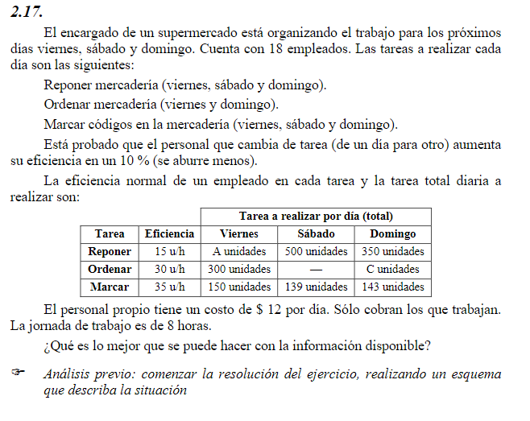
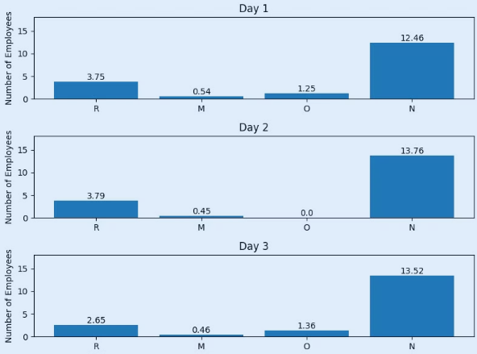
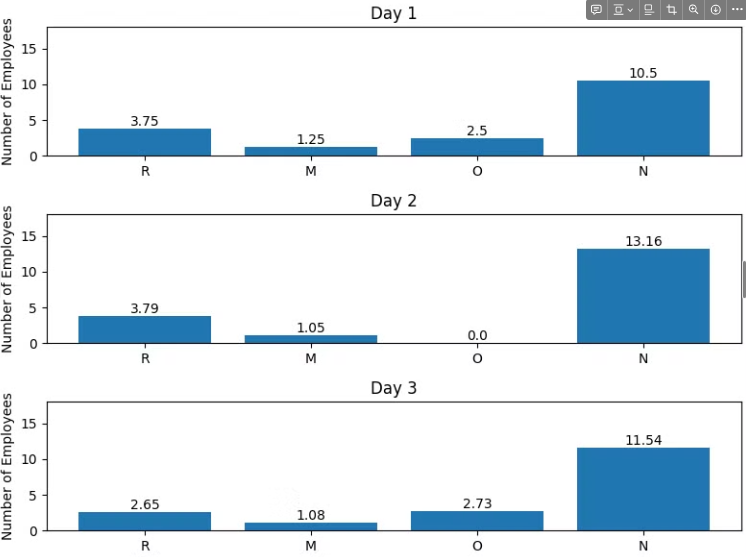
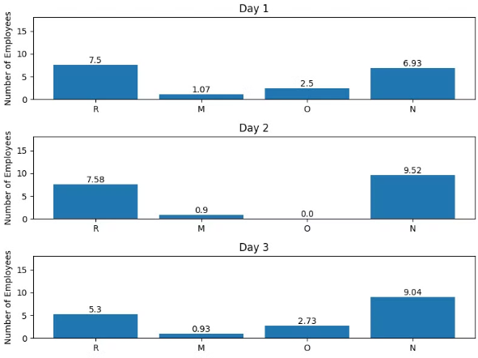
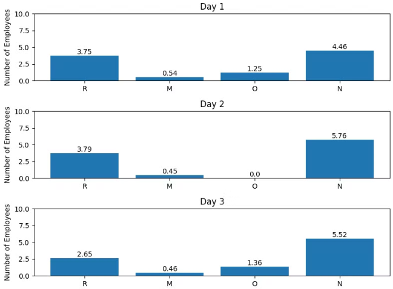

## <br> Caso 1:
``` Cpp
DIAS = 3
TOTAL_EMPLEADOS = 18
EFICIENCIA = {"R": 15, "O": 30, "M": 35, "N": 0}
A = 450
C = 360
TURNO_HS = 8
```



## <br> Caso 2: Disminucion eficiencia de tareas
> O=15 y M=15

```Cpp
DIAS = 3
TOTAL_EMPLEADOS = 18
EFICIENCIA = {"R": 15, "O": 15, "M": 15, "N": 0}
A = 450
C = 360
TURNO_HS = 8
```

### Comentario
Al ser menos eficiente, necesitas mas empleados
- Las tareas aumentan la cantidad de empleados
- La cantidad de empleados sin realizar tarea baja
  



### <br> Caso 3: Disminucion horas de turno de trabajo
> Pasamos de 8hs a 4hs
``` Cpp
DAYS = 3
TOTAL_EMPLEADOS = 18
EFICIENCIA = {"R": 15, "O": 30, "M": 35, "N": 0}
A = 450
C = 360
TURNO_HS = 4
```

### Comentario
- Al haber menos horas de trabajo, necesitas reposicion de empleados para terminar con las tareas → aumento de empleados
- Reposicion es la tarea menos eficiente, su aumento es mayor en comparacion a las otras tareas




### <br> Caso 4: Disminuimos la cantidad de empleados
> Pasamos de 18 a 10
```cpp
DIAS = 3
TOTAL_EMPLEADOS = 10
EFICIENCIA = {"R": 15, "O": 30, "M": 35, "N": 0}
A = 450
C = 360
TURNO_HS = 8
```

### Comentario
- como se cumple la demanda (como en este caso) solo cambian los empelados que no hacen nada

