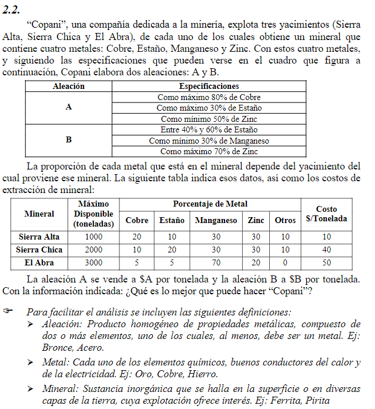

## Analisis
Se trata de un problema de ***mezcla***, donde se extraen minerales de yacimientos, donde estas tienen un costo por extraccion. Los recursos extraidos tienen porcentaje de metales 4 metales necesarios y restos de otros, con los que voy a producir los productos $A$ y $B$ para su venta.

> Los problemas de ***mezcla*** se enfocan en determinar las proporciones óptimas de varios ingredientes o componentes para crear un producto final que cumpla con ciertas especificaciones.

##   Objetivo
- **Que hacer**: Determinar la cantidad de toneladas de $A$ y de $B$
- **En cuanto**: En un periodo determinado (supongo que es mes)
- **Para que**: Para maximizar las ganancias

##   Supuestos
- El porcertaje de los metales en los minerales extraidos de una mina siempre son iguales 
- No hay inflacion
- No hay restriccion de mano de obra ni financiera
- Los gastos de energia estan cubiertos externamente
- Se vende todo lo que se produce 
- No hay inflacion ni variacion de precios
- No hay restriccion de mano de obra ni financiera
- Se puede extrar cantidades fraccionarias - pequeñas 
- No hay limites fisicos de almacenamiento de productos
- Todo tipo de metal obtenido de yacimientos distintos son iguales e indistinguibles entre si
- No hay fallas de produccion ni desperdicio.
- Todo lo extraido de los yacimientos es utilizables.

##   Variables
> Variables de decision para ***mezcla***: Proporciones de los ingredientes

- $Cu, Sn, Mg, Zn, OT$ (continuas): Toneladas de metales extraidos en un mes $\frac{toneladas}{mes}$

> 💡 Como voy a tener dos productos que dependen de ingredientes, tengo que saber cuantos ingredientes se necesitan para cada uno.  
> Subdivido las variables

- $Cu_A, Sn_A, Mg_A, Zn_A$ (continuas): Toneladas de metales utilizados en la produccion de $A$ en un mes $\frac{toneladas}{mes}$

- $Cu_B, Sn_B, Mg_B, Zn_B$ (continuas): Toneladas de metales utilizados en la produccion de $B$ en un mes $\frac{toneladas}{mes}$

- $Y_{SA}, Y_{SC}, Y_{EA}$ (continuas): Cantidad de toneladas extraidas del yacimiento en un mes $\frac{toneladas}{mes}$ 

- $P_A , P_B$ (continuas): Ganancias de venta de aleaciones por tonelada $ \frac{\$}{tonelada} $

##   Funcion Objetivo
> Como estas dos variables $P_A, P_B$ no estan inicializadas, creeria que en el futuro las voy a suponer  
> Todo lo que sea dinero se agrega de termino en la funcion objetivo  
> Las variables son las variables de desicion!

$$Max(Z) = P_A \frac{A\$}{tonelada} + P_B \frac{B\$}{tonelada} - Y_{SA} \frac{10\$}{tonelada} - Y_{SC} \frac{40\$}{tonelada} - Y_{EA} \frac{50\$}{tonelada} $$

##   Restricciones
> Restricciones para ***mezcla***: Principalmente relacionadas con las   características del producto final

#### Porcentajes de aleacion de A
- $ A = Cu_A + Sn_A + Zn_A $
- $ 0.8 A \ge C_{A} $ esto se traduce como $ 0.8(Cu_A + Sn_A + Zn_A) \ge C_{A}$
- $ 0.3 A \ge Sn_{A} $ esto se traduce como $ 0.3(Cu_A + Sn_A + Zn_A) \ge Sn_{A}$
- $ 0.5 A \le Z_{A} $ esto se traduce como $ 0.5(Cu_A + Sn_A + Zn_A) \le Z_{A}$

#### Porcentajes de aleacion de B
- $ B = Cu_B + Sn_B + Zn_B $
- $ 0.4 B \ge Sn_{B} \ge 0.6 $
- $ 0.3 B \le Mg_{B} $
- $ 0.7 B \ge Zn_{B} $

### Recursos

> ⛔🤚🏼 Esto que plantie esta mal, yo cuando saco una tonelada de un yacimiento, voy a tener una proporcion fija de metales extraidos.  
> Por como esta planteada aca, los porcentajes de cada metal varian en cada extraccion. 
>
> **Sierra Alta**: $C_{SA} = 20 Cu + 10 Sn + 30 Mg + 10 OT \le 1000 \frac{tonelada}{mes}$  
> **Sierra Chica**: $C_{Sc} = 10 Cu + 20 Sn + 30 Mg + 10 OT \le 2000 \frac{tonelada}{mes}$   
> **El Abra**: $C_{EA} = 5 Cu + 5 Sn + 70 Mg \le 3000 \frac{tonelada}{mes}$ 

#### Disponibilidad
- **Sierra Alta**: $Y_{SA} \le 1000 \frac{toneladas}{mes}$
- **Sierra Chica**: $Y_{SC} \le 2000 \frac{toneladas}{mes}$
- **El Abra**: $Y_{EA} \le 3000 \frac{toneladas}{mes}$

> 💡 Capas sea mejor hacer restricciones en base a los ingredientes utilizados  
> Hay ingredientes que se usan en ambos productos, estos los tengo que fraccionar y luego sumar para el total  
- **Obtención de Cobre**: $ 0.2 Y_{SA} + 0.1 Y_{SC} + 0.05 Y_{EA} \ge Cu_{A} $
- **Obtención de Estaño**: $ 0.1 Y_{SA} + 0.2 Y_{SC} + 0.05 Y_{EA} \ge Sn_{A} + Sn_{B} $
- **Obtención de Magnesio**: $ 0.3 Y_{SA} + 0.3 Y_{SC} + 0.7 Y_{EA} \ge Mg_{B} $
- **Obtención de Zinc**: $ 0.3 Y_{SA} + 0.3 Y_{SC} + 0.2 Y_{EA} \ge Zn_{A} + Zn_{B} $

##   Resolucion por software