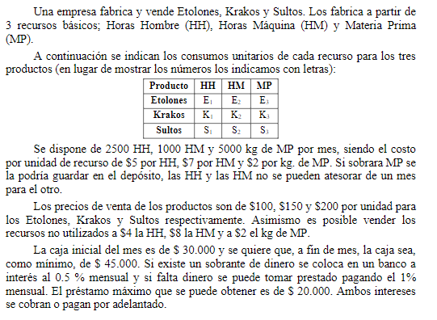

## Analisis

Problema de planificacion de produccion
Una empresa fabrica 3 productos a partir de 3 recursos basicos, donde cada producto tiene consumos unitarios de cada recurso.
Se dispone una disponibilidad por mes de recursos. Ademas cada recurso tiene un costo por uso.
Se puede almacenar en el deposito HH y MP pero HM no puede guardarse mas.
Tambien es posible vender recursos no utilizados (en el caso de hm tienen que venderse el mismo mas)
Se quiere lograr un increment ode capital de minimo 45.000$ por mes.
Existe como recurso colocar el dinero en un banco y obtener ganancias de 0.5% mensual
O tambien se puede pedir prestamos de 20000$ pagando 1% mensual.

##   Objetivo
- **Que hacer**: Determinar la cantidad de unidades de productos a realizar
- **En cuanto**: en un mes
- **Para que**: maximizar ganancias

##   Supuestos
- 
-
-
-

##   Variables

##   Funcion Objetivo
$$Max(Z) = $$
$$Min(Z) = $$

##   Restricciones

##   Resolucion por software