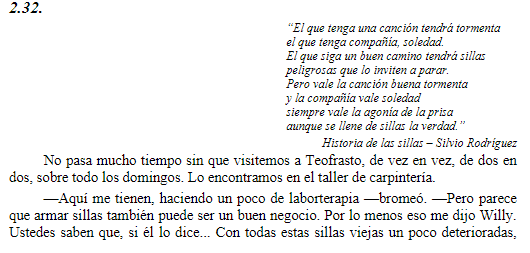
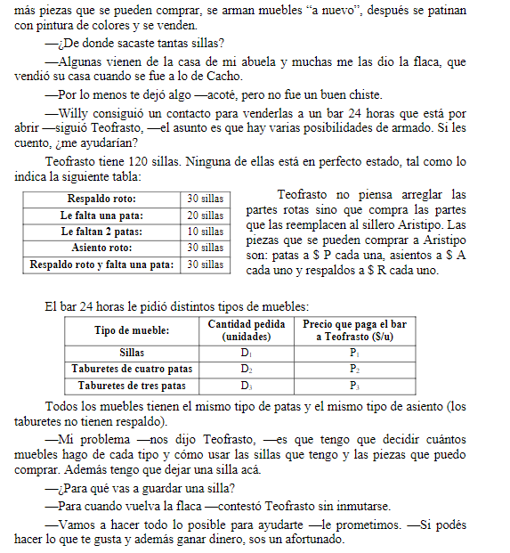

## Analisis

##   Objetivo
- **Que hacer**: Determinar cuantos muebles hace de cada tipo
- **En cuanto**:
- **Para que**: Minimizar costos

##   Supuestos
- 
-
-
-

##   Variables
- **Determinar**: $P$ precio de patas de asiento
- **Determinar**: $A$ precio asiento
- **Determinar**: $R$ precio de respaldo

> TENGO QUE DEJAR UNA SILLA

- $C_p$ Cantidad de patas compradas
- $C_$

##   Funcion Objetivo
$$Min(Z) = $$

##   Restricciones

##   Resolucion por software