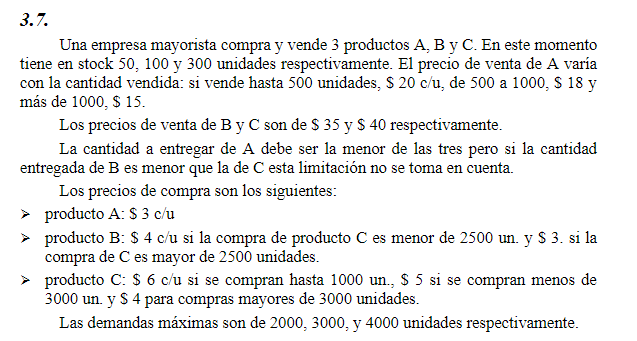

## Analisis
***Problema de planificacion de compra de productos.***

El precio de venta de un producto varia dependiendo la cantidad vendidad.
Hay restricciones sobre la cantidad de entrega de un producto, esta depende de las ventas de los ortos dos.
Se cuenta con un stock inicial.
Los precios de compra de productos estan determinados, el valor de estos varia dependiendo las condiciones
Tambien se sabe las demandas maxima que hay para vender.

##   Objetivo 
- **Que hacer**: Determinar cuantos productos comprar
- **En cuanto**: en un tiempo determinado, un mes
- **Para que**: Para maximizar las ganancias de venta

##   Supuestos
- Los costos no se acumulan, 
- No hay limite para la cantidad a comprar de producto
- Hay mano de obra y capital suficiente
- No hay inflacion
- No hay fallas en los productos, tanto en la compra, como en al venta
- Se venden productos de forma entera
- Se logra vender hasta satisfacer la demanda maxima
- 

##   Variables
- Productos: $i$ = {$A,B,C$}
- $X_{si}$: productos $i$ en stock inicial
- $X_{ci}$: productos $i$ comprados 
- Producto $i$ para la venta: $X_i = X_{ci} + X_{si}$

### Stock inicial
- $X_{sA} = 50$
- $X_{sB} = 100$
- $X_{sC} = 300$

### Bivariantes precio venta A
$$
Y_{A1} =
\begin{cases}
    1 & \text{si} & A \leq 500\\
    0 & sino
\end{cases}
$$

$$
Y_{A2} =
\begin{cases}
    1 & \text{si} & 500 \leq A \leq 1000 \\
    0 & sino
\end{cases}
$$

$$
Y_{A3} =
\begin{cases}
    1 & \text{si} & 1000 \leq A \\
    0 & sino
\end{cases}
$$

### Bivariantes precio de compra B

$$
Y_{B1} =
\begin{cases}
    1 & \text{si} & X_C \leq 2500 \\
    0 & sino
\end{cases}
$$
$$
Y_{B2} =
\begin{cases}
    1 & \text{si} & 2500 \leq X_C \\
    0 & sino
\end{cases}
$$

### Bivariantes precio de compra C

$$
Y_{C1} =
\begin{cases}
    1 & \text{si} & X_C \leq 1000 \\
    0 & sino
\end{cases}
$$
$$
Y_{C2} =
\begin{cases}
    1 & \text{si} & 1000 \geq X_C \geq 3000 \\
    0 & sino
\end{cases}
$$
$$
Y_{C3} =
\begin{cases}
    1 & \text{si} & 3000 \leq X_C \\
    0 & sino
\end{cases}
$$

##   Funcion Objetivo
- Ganancia = $(20 Y_{A1} + 18 Y_{A2} + 15 Y_{A3}) X_A + 35 X_B + 40 X_C$
- Costo = $3 X_{cA} + (4Y_{B1} + 3Y_{B2}) X_{cB} + (6Y_{C1} + 5Y_{C2} + 4Y_{C3}) X_{cC}$
$$Max(Z) = Ganancia - Costo$$

##   Restricciones
### Relacion stock compra y venta
- $X_i = X_{ci} + X_{si}$ 
- $X_A \leq 2000$
- $X_B \leq 3000$
- $X_C \leq 4000$
  
### Bivariantes
> ME FALTA DEFINIRLAS
- $Y_{A1} + Y_{A2} + Y_{A3}$
- $Y_{B1} + Y_{B2}$
- $Y_{C1} + Y_{C2} + Y_{C3}$
