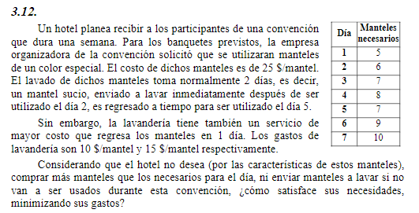

## Analisis

Recibir participantes en una convencion que dura una semana
los banquetes se utilizan manteles de color especial
el costo de los manteles es de 25$

El lavado toma 2 dias
- el mantel sucio, enviado a lavar inmediatamente despues de ser utilizado el dia 2, es regresado para utilizar el 5. se tomo el dia 3 y 4 para lavado

la lavanderia tiene servicios
- lavado normal: 2 dias - 10$
- lavado rapido: 1 dia  - 15$

El hotel comprar mas manteles que los necesarios para el dia
ni enviar manteles a laavar si no van a ser usados durante la convencion

como se satisface la necesidad minimizando gastos

##   Objetivo
- **Que hacer**: determinar cuantos manteles se van a comprar y determinar el uso de la lavanderia para recibir a los participantes
- **En cuanto**: una semana
- **Para que**: minimizar gastos

##   Supuestos
- No se van a comprar mas manteles de los necesarios para el dia
- No se envian manteles a lavar si no van a ser utilizados
- Los manteles utilizados el dia 6 que no van a ser utilizados el dia 7 no se van a lavar
- Los manteles utilizados el dia 7 no se van a lavar
- Tenemos capital suficiente
- Todo mantel lavado vuelve a su estado original (limpio por completo)
- Todo mantel usado un dia, se considera sucio
- No hay gastos de transporte a la lavanderia
- No hay restricciones fisicas de almacenamiento
- No hay inflacion

##   Variables
- $M$ = cantidad total de manteles comprados
- $L_{nor}$ = cantidad de prendas lavadas de forma normal 
- $L_{rap}$ = cantidad de prendas lavadas de forma rapida
- $L_i$ = cantidad de limpios manteles sucios por dia i = {1..7}
- $U_i$ = cantidad de limpios por dia i = {1..7}

##   Funcion Objetivo
$$Min(Z) = \frac{24\$ M}{mantel} + \frac{10 L_{nor}}{mantel} + \frac{15 L_{rap}}{mantel}$$

##   Restricciones

### Stock manteles limpios y sucios
- Manteles totales: $M = L_i + U_i$  , $\forall i$ = {1..7} 

### Maneles para satisfacer demanda
- Dia 1: $L_1 \ge 5$
- Dia 2: $L_2 \ge 6$
- Dia 3: $L_3 \ge 7$
- Dia 4: $L_4 \ge 8$
- Dia 5: $L_5 \ge 7$
- Dia 6: $L_6 \ge 9$
- Dia 7: $L_7 \ge 10$

##   Resolucion por software