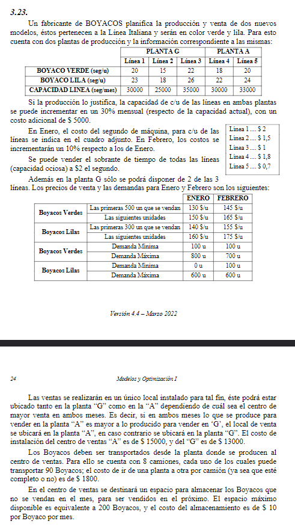

## Analisis

##   Objetivo
- **Que hacer**: determinar la cantidad de boyacos a producir y vender
- **En cuanto**: en 2 meses
- **Para que**: maximizar ganancias

##   Supuestos
- Contamos con mano de obra suficiente
- No hay cortes en la produccion
- No hay inflacion
- Contamos con capital suficiente
- Todos los boyacos producidos de un mismo tipo poseen las mismas caracterisitcas, de igual calidad, sin importar la linea/planta que lo produjo
- No hay stock inicial
- El costo de almacenamiento es en base al stock final del mes
- Solo se transportan los boyacos producidos

##   Variables
- Tipos: $i$ = {v, l}
- Planta: $k$ = {A,G}
- Lineas: $j$ = {1,2,3,4,5}
- Mes: $m$ = {e, f}

 

- $P_{mi}$: cantidad de boyacos de tipo $i$ producidos en el mes $m$
- $P_{mj}$: cantidad de boyacos producidos en la linea $j$ en el mes $m$
- $P_{mk}$: cantidad de boyacos producidos en la planta $k$ en el mes $m$
- $P_{mij}$: cantidad de boyacos de tipo $i$ producidos en la linea $j$ en el mes $m$
- $t_{mij}$: tiempo que le toma producir el producto $i$ en la linea $j$ en el mes $m$

 

- $C_{mj}$: Capacidad de la linea $j$ en el mes $m$
- $CS_{m}$: Capacidad sobrante en el mes $m$
- $CS_{mj}$: Capacidad sobrante de la linea $j$ en el mes $m$

 

- $V_{mi}$: cantidad de boyacos de tipo $i$ vendidos en el mes $m$
- $V_{mi1}$: Boyacos de tipo $i$ vendidos antes de llegar a las 500 ventas en el mes $m$
- $V_{mi2}$: Boyacos de tipo $i$ vendidos despues de llegar a las 500 ventas en el mes $m$

 

- $Cm_{m}$: Cantidad de camiones utilizados para transportar boyacos de una planta a otra en el mes $m$
  - Variable entera: $Cm$ = {0,1..,8}

 

- $Si_{m}$: Stock inicial del mes $m$
- $Sf_{m}$: Stock final del mes $m$

##   Variables binarias

$$ 
    Y_{mi} = 
        \begin{cases}
            1 && \text{tenemos que incrementar la capacidad en el mes $m$} \\
            0 && {sino}            
        \end{cases}
    \\
    Y_{mv1} =
        \begin{cases}
            1 && \text{si} && V_{bv} \le 500 && \text{en el mes $m$} \\
            0 && \text{las siguientes unidades}
        \end{cases}

    \\
    Y_{ml1} =
        \begin{cases}
            1 && \text{si} && V_{lv} \le 300 && \text{en el mes $m$} \\
            0 && \text{las siguientes unidades}
        \end{cases}

    \\
    Y_{mlocal} =
        \begin{cases}
            1 && \text{se elige centro de venta A} && \text{en el mes $m$} \\
            0 && \text{se elige centro de venta G} && \text{en el mes $m$}
        \end{cases} 
    \\
    Yd_{mi} =
        \begin{cases}
            1 && \text{Se utiliza la linea i} && \text{con i={1,2,3} en el mes $m$} \\
            0 && \text{sino}
        \end{cases} 
$$

##   Funcion Objetivo

$$
    CostoProduccion_m = 
            2 (20 P_{mv1} + 23 \cdot P_{ml1})
        + 1.5 (15 P_{mv2} + 18 \cdot P_{ml2})
        +   1 (22 P_{mv3} + 26 \cdot P_{ml3}) 
        + 1.5 (18 P_{mv4} + 22 \cdot P_{ml4})
        + 0.7 (20 P_{mv5} + 24 \cdot P_{ml5})
$$

$$ 
    Max_{ene} = 
          130 V_{1v1} + 150 V_{1v2}
        + 140 V_{1l1} + 160 V_{1l2}
        - 5000 (Y_{1l1} + Y_{1l2} + Y_{1l3} + Y_{1l4} + Y_{1l5})
        - CostoProduccion_{1}
        + 2 CS_{1}
        - (15000 Y_{1local} + 13000 (1 - Y_{1local}))
        - 1800 Cm_{1}
        - 10 (Sf_{1})
$$

$$ Max_{feb} = 
          145 V_{2v1} + 165 V_{mv2}
        + 155 V_{2l1} + 175 V_{ml2}
        - 5000 (Y_{2l1} + Y_{2l2} + Y_{2l3} + Y_{2l4} + Y_{2l5})
        - 1.1 \cdot CostoProduccion_{2}
        + 2 CS_{2}
        - (15000 Y_{2local} + 13000 (1 - Y_{2local}))
        - 1800 Cm_{2}
        - 10 (Sf_{2})
$$

$$Max(Z) = Max_{ene} + Max_{feb} $$

##   Restricciones

### Capacidad productiva:
> hacer para m=1 y m=2
- $20 P_{mv1} + 23 P_{ml1} \leq 30000 (1 + 0.3 Y_{m1})$
- $15 P_{mv2} + 18 P_{ml2} \leq 25000 (1 + 0.3 Y_{m2})$
- $22 P_{mv3} + 26 P_{ml3} \leq 35000 (1 + 0.3 Y_{m3})$
- $18 P_{mv4} + 22 P_{ml4} \leq 30000 (1 + 0.3 Y_{m4})$
- $20 P_{mv5} + 25 P_{ml5} \leq 33000 (1 + 0.3 Y_{m5})$

### Produccion linea
> el producto final se multiplica por las partes
> 4 autos = ruedas

> $t_{mij}$: tiempo que le toma producir el producto $i$ en la linea $j$ 
> $C_{j}$: Capacidad de la linea $j$
- Tiempo Total Producido = $\sum_{j} \sum_{i} t_{ij} P_{ij} = CS - \sum_{j} CP_{j} \cdot (1 + 1.3 Y_{j})$
- Relacion produccion de linea: $P_{vj} + P_{lj} = P_{j}$

 

- Lineas en G: $Yd_1 + Yd_2 + Yd_3 \le 2$
#### Indicadoras
- $Yd_1 \leq P_{1} \leq 999999 Yd_1$
- $Yd_2 \leq P_{2} \leq 999999 Yd_2$
- $Yd_3 \leq P_{3} \leq 999999 Yd_3$

#### Demandas
- $100 \leq V_{1v} \leq 800$
- $0 \leq V_{1l} \leq 600$
- $100 \leq V_{1v} \leq 700$
- $100 \leq V_{2l} \leq 600$

#### Stock
- $Si_{vi} + P_{mi} = V_{mi} + Sf_{mi}$
- $Si_{m} \leq 200$
- $Sf_{m} \leq 200$

#### Local
- $P_{mG} = P_{m1} + P_{m2} + P_{m3}$
- $P_{mA} = P_{m4} + P_{m5}$
- $P_{mG} + 99999 \cdot Y_{local} \geq P_{mA}$

#### Camion
- $0 \leq Cm \leq 8$
- $Y_{local} P_{A} + (1-Y_{Local}) P_{G} \leq 90 \cdot Cm$