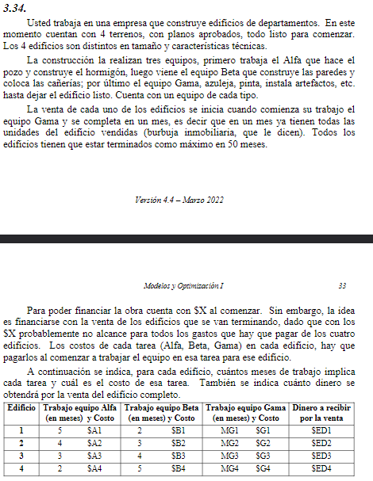

##   Objetivo
- **Que hacer**: Determinar el secuencia de construccion
- **En cuanto**: En 50 meses
- **Para que**: Minimizar el tiempo

##   Supuestos
- No hay inflacion
- El personal es siempre el mismo, no hay despidos y nuevos empleados 
- Un equipo no puede trabajar en 2 edificios al mismo tiempo
- No hay retrasos en el trabajo de cada equipo
- La caja no puede tener un saldo negativo
- La venta se percibe al inicio del mes

##   Variables
- Edificios: $i$ = {1,2,3,4}
- Equipo: $j$ = {A,B,C}
- $I_{ij}$: Mes de inicio de trabjo el equipo $j$ en el edificio $i$
- $F_{ij}$: Mes de finalizacion de trabajo el equipo $j$ en el edificio $i$

##   Constantes
- $D_0$: Disponibilidad inicial
- $T_{ij}$: Tiempo en meses de trabajo del equipo $j$ en el edificio $i$

##   Variables binarias

$$
    Y_{anuloik} = 
        \begin{cases}
            1 && \text{el equipo $i$ no esta haciendo una tarea} \\
            0 && \text{si sí}
        \end{cases}
$$

##   Funcion Objetivo
$$Min(Z) = FINAL$$

##   Restricciones
- $F_{ij} = I_{ij} + T_{ij}$
- $F_{ij} \leq FINAL$ 

### Orden
- $F_{2A} \le I_{2B}$
- $F_{2B} \le I_{2C}$
- $F_{ij} \leq I_{i(j+1)}, \forall j\leq2$ 

### Momento de trabajo de cada equipo
- $F_ij \leq I_{kj} + M Y_{anuloik} , \forall i \neq k$
- $Y_{anuloik} + Y_{anuloki} = 1$

### Financiacion
- $D_{0} = X$

---
> ver
> 
> exceso y egreso
> 
> costo beneficio

