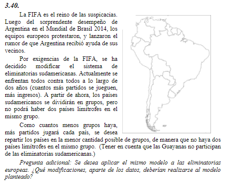

## Analisis

##   Objetivo
- **Que hacer**: Determinar los cantidad de paises por grupos de las eliminatorias
- **En cuanto**: en un tiempo determinado (d)
- **Para que**: maximizar ganancias

##   Supuestos
- 
-
-
-

##   Variables

##   Funcion Objetivo
$$Max(Z) = $$
$$Min(Z) = $$

##   Restricciones

##   Resolucion por software