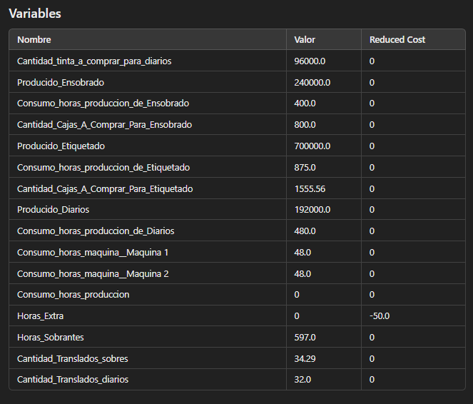
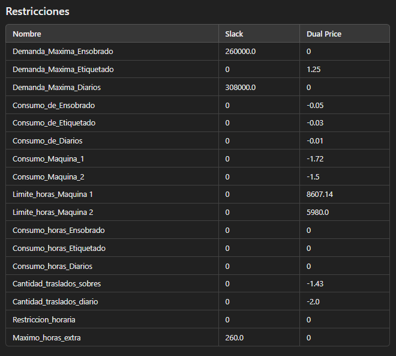
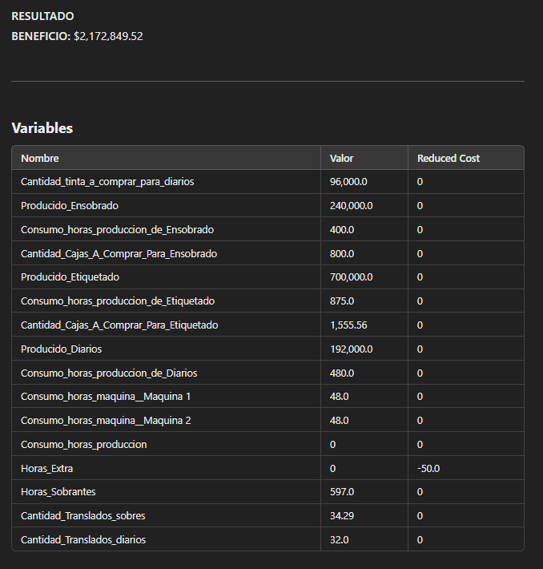
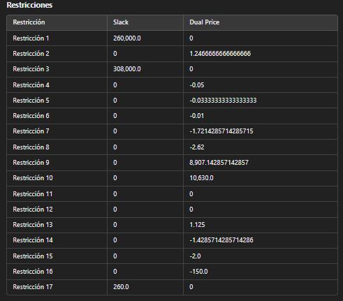
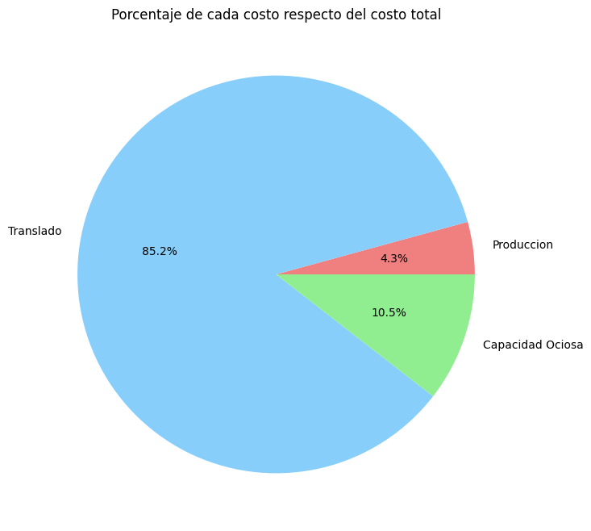
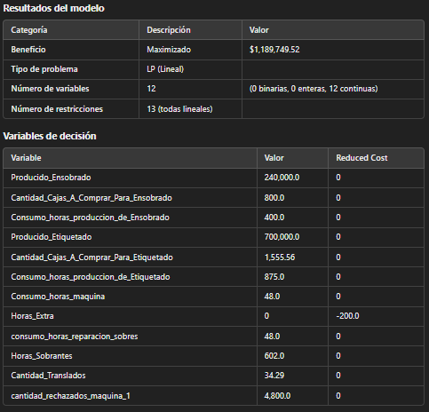
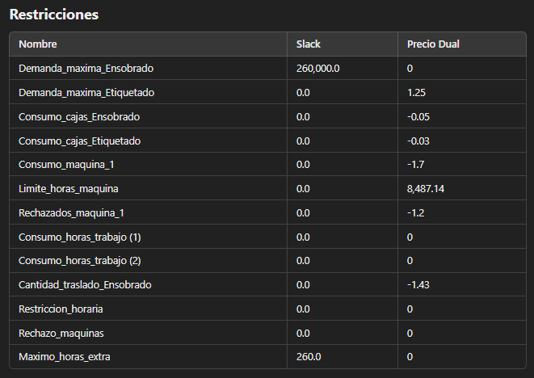
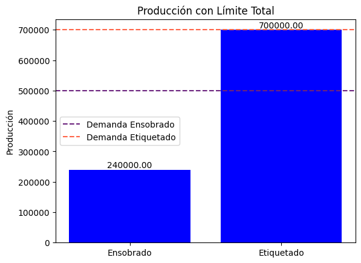

# Trabajo Final Modelos y Optimizacion I 
### Noviembre 2024
#### Integrantes
- Agustin Demicheli 
- Santiago Jorda
- Nahuel Godoy
- Estefano Polizi 

## 1. Papeleria Godoy SRL

La familia Godoy se dedica hace 30 años al rubro de la papelería,  cuenta con una fábrica en la que elaboran 2 productos, sobres y etiquetas,  la papelería contrató a 13 trabajadores, los cuales trabajan de lunes a sábados con turnos de 8 HS/DÍA, además cuenta con una máquina M1 que se dedica al doblado de las hojas. Esta cuenta con una disponibilidad de 48 horas máquina, para evitar de esta manera un costoso mantenimiento constantemente.
Los recursos se obtienen de dos fuentes, del cliente quien proveerá la materia prima para realizar el trabajo solicitado y además un mayorista de cajas a un precio de $15 la unidad.
Cada persona dedicada a producir sobres demora 1 hora en hacer 600 sobres, y 800 etiquetas. Por otro lado, las máquinas funcionan de manera mucho más eficiente demorando 1 hora en hacer 5000 sobres con lo indicado.
Se utilizan fletes para entregar los sobres terminados, cada encomienda puede transportar 7000 de los mismos, y este posee un precio de $10.000
 ¿Qué sería lo mejor que puede hacer la familia Godoy?

## 2. Agregar Producto

La papelera Godoy quiere agregar a su producción la producción de diario personalizados. Se utilizará una vieja máquina de impresión M2 que tenían guardada. 
Por cada diario se utilizan 500 mililitros de tinta. La tinta se compra en el mayorista por litro a un precio de $10.
El papel diario es brindado por los clientes.
Cada persona que hace el trabajo manual de doblar los diarios puede hacer 400 por hora. La máquina 2 puede trabajar 48 horas por mes. Necesita que un solo operador esté a cargo.
Los fletes pueden transportar hasta 6000 diarios al mismo precio de antes.

## 3. Control de Calidad

La papalera enfrenta desafíos de calidad debido a defectos generados por el uso de maquinaria, lo que requiere un proceso adicional de reparación para mantener los estándares del producto.
Un porcentaje del 2% de los sobres producidos por la máquina son rechazados debido a defectos y deben ser reparados, lo que genera costos adicionales en términos de tiempo y dinero $1.2 por cada sobre rechazado.

# Informe caso base

## Objetivo

El objetivo es determinar la cantidad a admitir de ensobrado y etiquetado, buscando maximizar el beneficio de producción en un mes.

## Hipótesis
 1. En producción para la demanda máxima no se pueden superar los limites (no hay razon mas alla para superar los limites)
 2. Para el consumo de recursos por unidad, de materia prima, es constante y conocida, no va a variar y no hay perdida.
 3. Para las horas base se depende de la cantidad de personal que trabaje
 4. Puede haber horas extras siempre y cuándo estén dentro del limite permitido
 5. Las horas extra son indistinguibles como se distribuye
 6. La producción de los operarios es constante y continua 
 7. La maquina produce con una capacidad constante
 8. Las horas de maquina consumen horas de personal
 9. El transporte tiene una capacidad fija, y siempre esta disponible en caso de ser necesario
 10. El costo del transporte es fijo
 11. La capacidad de las cajas es exacta siempre

## Variables

Las variables del modelo:

- $Producido\ servicio$: Cantidad de unidades producidas de cada servicio.
- $Cantidad\ Cajas\ A\ Comprar\ Para\ servicio$: Cantidad de cajas necesarias para cada servicio.
- $Consumo\ horas\ produccion\ de\ servicio$: Horas necesarias para la producción de cada servicio.
- $Consumo\ horas\ maquina$: Horas de uso de la máquina.
- $Horas\ Extra$: Horas adicionales de trabajo necesarias.
- $Horas\ Sobrantes$: Horas sobrantes de producción que no se utilizan.
- $Cantidad\ de\ Traslados$: Cantidad de traslados necesarios para transportar el producto.

Siendo $Servicio$: ${Ensobrado,Etiquetado}$

## Constantes

- $LIMITES\ PRODUCCION\ servicio$: Límite de producción de cada servicio.
- $CAPACIDAD\ CAJA\ servicio$: Capacidad de cajas para cada servicio.
- $PRODUCCION\ MAQUINA_A$: Cantidad de producción de máquina para el servicio A.
- $LIMITE\ HORAS\ MAQUINA_A$: Límite de horas de máquina disponibles para el servicio A.
- $PRODUCCION\ HORA\ servicio$: Cantidad de producción por hora de cada servicio.
- $PERSONAL\ NECESARIO\ MAQUINA_A$: Personal necesario para el uso de la máquina para el servicio A.
- $LIMITE\ HORAS\ HOMBRE$: Límite de horas hombre disponibles.
- $MAXIMO\ HORAS\ EXTRA\ PERSONAL$: Límite máximo de horas extra disponibles para el personal.
- $CAPACIDAD\ TRASLADO\ A$: Capacidad de traslado del servicio A.
- $PRECIO\ VENTA\ SERVICIO$: Precio de venta de cada servicio.
- $PRECIO\ CAJAS$: Precio por caja utilizada en la producción de cada servicio.
- $PRECIO\ HORA\ EXTRA$: Precio por hora extra de trabajo.
- $PRECIO\ TRANSLADO_A$: Precio por traslado del servicio A.
- $COSTO\ FIJO$: Costo fijos.

## Función Objetivo

La función objetivo del modelo es maximizar el beneficio de la empresa. El beneficio se calcula como la diferencia entre los ingresos y los costos. La fórmula es:

$Beneficio$ = $Ingresos$ - $Costos$

Donde los **ingresos** y **costos** son:

- **Ingresos**:
  $$
  \text{Ingresos} = \sum_{servicio} \text{Precio Venta}_{servicio} \cdot \text{Producido}_{servicio}
  $$

- **Costos**:
  - Materia Prima:
    $$
    \text{Costo Materia Prima} = \sum_{servicio} \text{Precio Cajas} \cdot \text{Cantidad Cajas}_{servicio}
    $$
  - Horas Extra:
    $$
    \text{Costo Horas Extra} = \text{Horas Extra} \cdot \text{Precio Hora Extra}
    $$
  - Traslados:
    $$
    \text{Costo Traslados} = \text{Cantidad Traslados} \cdot \text{Precio Traslados}_A
    $$

## Restricciones

1. **Demanda Máxima**:
   $$
   \text{Producido}_{servicio} \leq \text{Límite de Producción}_{servicio}, \quad \forall \, servicio
   $$

2. **Consumo de Recursos**:
   - **Cajas**:
     $$
     \text{Capacidad Caja}_{servicio} \cdot \text{Cantidad Cajas}_{servicio} = \text{Producido}_{servicio}, \quad \forall \, servicio
     $$
   - **Máquina**:
     $$
     \text{Producción Máquina}_A \cdot \text{Horas Máquina} = \text{Producido}_A
     $$
     $$
     \text{Horas Máquina} \leq \text{Límite Horas Máquina}_A
     $$
   - **Horas de Producción**:
     $$
     \text{Producción por Hora}_{servicio} \cdot \text{Horas de Producción}_{servicio} = \text{Producido}_{servicio}, \quad \forall \, servicio
     $$
     $$
     \text{Horas de Producción Totales} = \text{Horas de Producción}_A + \text{Horas de Producción}_B
     $$
   - **Traslados**:
     $$
     \text{Capacidad Traslado}_A \cdot \text{Cantidad Traslados} = \text{Producido}_A
     $$

3. **Restricciones Horarias**:
   $$
   \text{Personal Necesario Máquina}_A \cdot \text{Horas Máquina} + \text{Horas de Producción Totales} = \text{Límite Horas Hombre} + \text{Horas Extra} - \text{Capacidad Ociosa}
   $$

4. **Máximo de Horas Extra**:
   $$
   \text{Horas Extra} \leq \text{Máximo Horas Extra Personal}
   $$
## Resultados

# Analisis de sensibilidad caso base
  # Preguntas
 - ¿Cuánto pagaría por dos unidades más de horas maquina? Justifique claramente
  su respuesta.

        El dual price asociado a las horas máquina (Restricción 8) es 0.1875. Entonces por cada unidad adicional de horas máquina, el beneficio incrementaría en $0.1875.

        Por dos unidades más de horas máquina:
          2×0.1875=0.375
        El incremento en el beneficio sería $0.375, podria pagarse por incremento si el precio es menor o igual a 0.375-m.

 - ¿Qué pasa si el coeficiente de etiquetado en el funcional disminuye en $3?
Justifique claramente su respuesta. Si considera que le falta información indicar qué
información le falta y qué situaciones se pueden presentar.

        Como falta informacion sobre los limites de variacion del coeficiente objetivo, hay dos posibles situaciones:
         -Si la disminucion esta dentro del rango entonces el modelo sigue siendo optimo, pero el beneficio disminuye en proporcion.
         -Si excede el rango, entonces se puede generar una nueva solucion optima que afecte al plan de produccion.
    
 

 - ¿Qué pasa si aumentamos el precio de ensobrado de $3.20 a $5? Justifique
claramente su respuesta.

        Como el ensobrado ya está en el máximo nivel de producción, el incremento no va a cambiar la solución actual, pero el beneficio va a aumentar. 
        La diferencia de precio es de 5 - 3,20 = 1,80
        Entonces el beneficio aumentaria en 240.000 (produccion actual) x 1,80 = 432.000 (lo que beneficio aumenta)

# Informe segundo caso
## Objetivo
Se agregó un tercer servicio que se produce y vende $Diarios$, el cual introduce además una máquina 2 que tiene $HM2$ disponibles y tiene una capacidad máxima de produccion $C$, se busca determinar que cántidad de servicio $Ensobrado$, $Etiquetado$ y $Diarios$ cuya variable es $A$, $B$ y $C$ respectivamente realizar en un mes para maximizar las ganancias.
## Hipotesis

- La Calidad del servicio $C$ realizado por la máquina $M2$ y por los operarios es indistinguible
- Los recursos conseguidos para la realización de $C$ no tienen fallas
- Los costos de la tinta por litro se mantiene constante a lo largo del mes ya que no le afecta la inflación
- El personal que trabaja con la máquina 2 trabaja con la misma eficiencia y cualquiera puede trabajar en ella
- Se cuenta con el capital necesario para la producción del producto $C$

## Variables

$C$ : Cantidad de diarios a producir y vender por mes\
$CONSUMO$ _$M2$ :  consumo de horas de máquina 2  por mes\
$CANTIDAD$ _$TINTA$ : cantidad de tinta a comprar para producir diarios\
$CANTIDAD$ _$DE$ _$TRASLADO$ _$DIARIOS$ : cantidad de traslado de diarios realizado por mes\
$CONSUMOS$ _$DE$ _$C$ : consumo de horas de produccion por $C$ por mes \
$COSTOS$ _$MATERIA$ _$PRIMA$ _$DIARIOS$ : costos de produccion diaria por el servicio $C$

## Constantes 
$LIMITES$_ $PRODUCCION$ _ $C$ = Limites de produccion de servicio C\
$PRECIO$_$TINTA$ = Precio de la tinta\
$TINTA$ _$DIARIO$ = Cantidad de tinta de para diario\
$PRECIO$ _$VENTA$ _$C$ = Precio de venta del servicio C\
$LIMITE$ _$HORAS$ _$MAQUINA$ _$2$ = Limite de horas maquina\
$PRODUCCION$ _$MAQUINA$ _$C$ = Capacidad de produccion de maquina 2 del servicio C\
$PERSONAL$ _$NECESARIO$ _$MAQUINA$ _$2$ = Cantidad de personal necesario para la maquina 2\
$PRODUCCION$ _$HORA$ _ $C$ = Cantidad de produccion por hora del servicio C\
$CAPACIDAD$ _$TRASLADO$ _ $C$ = Capacidad de traslado del servicio C\
$PRECIO$ _$TRASLADO$ _$C$ = Precio de traslado del servicio C

## Funcion Objetivo

 $INGRESOS$ se agrego -> $PRECIO$ _$VENTA$ _$C$ * $C$ y en los\
 $COSTOS$ se agrego -> $COSTOS$ _$MATERIA$ _$PRIMA$ _$DIARIOS$ 
 donde $COSTOS$ _$MATERIA$ _$PRIMA$ _$DIARIOS$  = 
$PRECIO$_$TINTA$ * $CANTIDAD$ _$TINTA$

## Restricciones y código modificado 

- $CANTIDAD$ _ $TINTA$ $=$ $producido[C]$ * $TINTA$_$DIARIO$\

- $PRODUCCION$ _ $MAQUINA[M2]*horas$ _$maquina[M2]$ = $producido[C]$

- $CAPACIDAD \_TRANSLADO[C]*cantidad \_translados\_diarios$ = $producido[C]$

- $suma$ _$horas$ _$maquina$ = $(PERSONAL$ _$NECESARIO$ _$MAQUINA[M1]$*$horas$_$maquina[M1])$ +  $(PERSONAL$ _ $NECESARIO$ _ $MAQUINA[M2]$*$horas$_ $maquina[M2])$ 

- $producido[servicio] \leq LIMITES$ _ $PRODUCCION[servicio]$

- $PRODUCCION$ _ $HORA[servicio]*horas$ _ $produccion$ _$producto[servicio]$ = $producido[servicio]$

## Servicios
Se agregó el servicio $Diarios$ el cual utiliza recursos tinta cuyo costo es $PRECIO$_$TINTA$ y la máquina $M2$ con todos los subitems que ello conlleva, precio de tinta, capacidad de produccion de diarios diaria, consumo de tinta diario

## Resultados
Lo que sucedió en este caso fue que se obtuvo una mayor ganancia debido a que es más rentable la venta de producir y vender diarios antes que tener una mayor capacidad ociosa ya que se les paga a los trabajadores por no hacer nada.

# Analisis de sensibilidad 
   # Preguntas
 - ¿Cuánto pagaría por dos unidades más de horas maquina? Justifique claramente
  su respuesta.

 - ¿Qué pasa si el coeficiente de diarios en el funcional disminuye en $3?
Justifique claramente su respuesta. Si considera que le falta información indicar qué
información le falta y qué situaciones se pueden presentar.

 - ¿Qué pasa si aumentamos el precio de diarios de $3.5 a $5? Justifique
claramente su respuesta.

# Informe tercer caso
## Variables
- $R_m$: Sobres rechazados por maquina
- $H_{rs}$: Horas invertidas en reparacion por maquina
## Constantes
- $C_{rs}$: Costo de reparacion sobre
- $PR_{M1}$: Porcentaje de rechazo
- $REP_{hr}$: Cantidad de reparacion por hora
## Restricciones
### Consumo Maquina
- Consumo: R_m = P_{A} * PR_{M1} 
### Rechazo Maquinas
- Rechazo: $R_m = H_{rs} * REP_{hr}$
### Costos reparacion
- Costo reparacion: $C_{rep} = R_m * C_{rs}$
- Costo total: $C_{total} = C_{mp} + C_{he} + C_{co} + C_{tr} + C_{rs}$
## Resultados

# Analisis de sensibilidad 
   # Preguntas
 - ¿Cuánto pagaría por dos unidades más de horas maquina? Justifique claramente
  su respuesta.

 - ¿Qué pasa si el coeficiente de rechazo disminuye?
Justifique claramente su respuesta. Si considera que le falta información indicar qué
información le falta y qué situaciones se pueden presentar.

 - ¿Qué pasa si aumentamos el consumo de horas invertidas en reparacion por maquina? Justifique
claramente su respuesta.